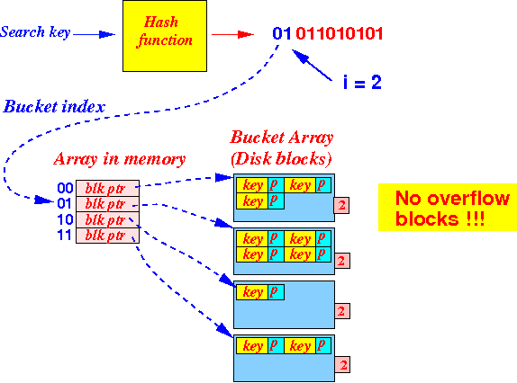
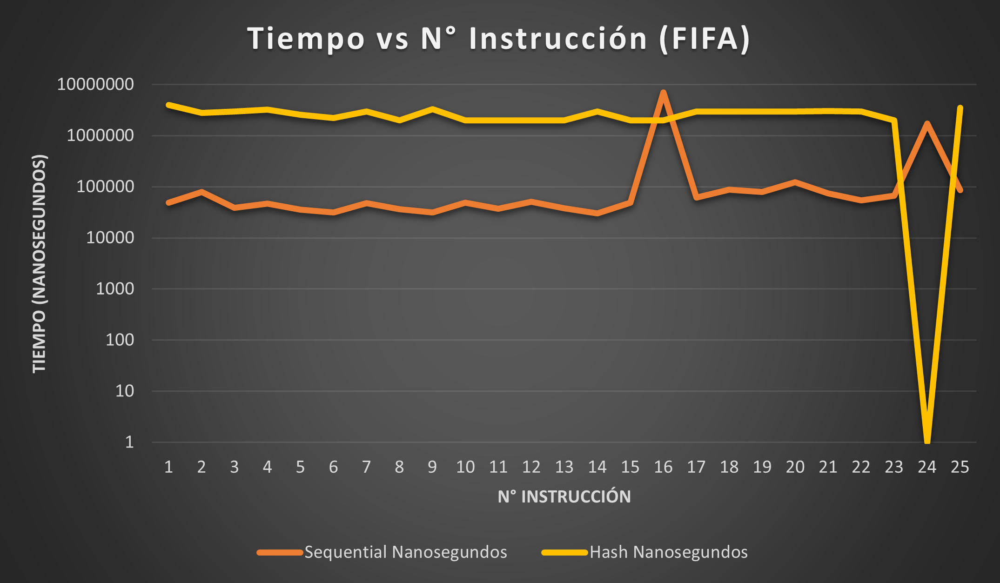

# Proyecto 1

## Integrantes

- Morales Panitz, Alexander 
- Ugarte Quispe, Grover
- Gutierrez Luis

| Apellidos y Nombres       | Código de alumno | % Participación |
|---------------------------|------------------|-----------------|
| Morales Panitz, Alexander | 202020195        | 100%            |
| Ugarte Quispe, Grover     | 202020195        | 100%            |
| Gutierrez Guanilo, Luis   | 202010074        | 100%            |

## Introducción

El presente proyecto tiene como objetivo el aprendizaje de los diferentes métodos de manejo de archivos e indexación en los sistemas de gestión de bases de datos por medio de su implementación en un lenguaje de programación de bajo nivel. Entre los medios de organización vistos se encuentran el archivo secuencial, ISAM, B+ tree y hash extensible. Para esta entrega del proyecto, se decidió realizar la implementación del archivo secuencial y hash extensible.

Con el motivo de demostrar un buen funcionamiento de las implementaciones, se decidió ponerlas a prueba mediante la carga/ construcción por medio de dos bancos de datos de la página Kaggle. El primer banco de datos corresponde a los valores nutricionales de marcas de cereales y el segundo corresponde a las cartas de jugadores del videojuego FIFA 22.


Posteriormente a lo mencionado, los datos serán alterados por medio de operaciones CRUD tales como: actualizar, eliminar, insertar, búsqueda singular y búsqueda por rango. Por motivos experimentales, se ha toma en cuenta el tiempo tomado en alguna operación y su cantidad de accesos a memoria secundaria con la finalidad de evaluar en que casos algún método de organización es más efectivo.

## Fundamentación de técnicas de organización de archivos

Como se mencionó anteriormente, los medios de organización a utilizar fueron el archivo secuencial y el hash extensible. Por ese motivo, es necesario explicar como es que se realizan las operaciones CRUD.

### Archivo Secuencial (Sequential File)

Esta técnica de indexación consiste en guardar los registros en un archivo de tal forma que se les adiciona un indicador entero que nos otorga el orden del siguiente registro con un carácter que define el archivo (‘a’ o ‘d’). Aquel indicador es también agregado antes del primer registro para saber cual es el registro con menor llave. Este mismo formato de registro-puntero es empleado en un archivo auxiliar que nos permite agregar una cantidad determinada de registros con una complejidad constante, hasta que sea necesario reorganizar el archivo de datos principal. En cuanto a los valores de los punteros, se definen como: eliminado (0), siguiente registro (>0) y ultimo registro (-1).


#### Insertar

- Si la cantidad de registros en el archivo auxiliar es igual a la máxima definida, se reorganiza el archivo
- Abrimos el archivo de datos en modo lectura y aplicamos una búsqueda binaria con los parámetros l y r
	- Si l <= r, entonces la llave existe, por lo que el algoritmo retorna una excepción
	- Si r == -1, entonces el registro insertado es el que tiene el menor orden, por lo que se lee el puntero en la cabecera
	- De lo contrario, leemos el registro l ya que es el puntero cuyo registro que lo acompañe tiene la llave que es un orden menor al registro insertado
- Sabiendo que el archivo auxiliar puede tener un registro mayor al leído pero menor al que está por añadir, se abre aquel archivo en lectura y se realiza una búsqueda lineal y se obtiene el orden del registro si alguno cumple
- Se abre el archivo auxiliar para agregar el nuevo registro y el puntero leído previamente
- Se va al orden del registro del archivo respectivo y se sobrescribe el puntero por la cantidad total de registros en el archivo auxiliar junto con el carácter ’a’

#### Remover

- Si la cantidad de registros eliminado en el archivo auxiliar es igual a lo máximo definida, se reorganiza el archivo
- Aplicamos el algoritmo de búsqueda para hallar el registro y puntero que coincidan con la llave introducida en la función.
	- Si no es hallada, se retorna una excepción
- Ya que los punteros también se encuentran ordenados (a excepción del archivo auxiliar), realizamos una búsqueda para hallar el registro y puntero que apunten a la posición de aquel registro y coincidan con su indicador de archivo.
	- Ambos archivos deben ser abiertos de tal forma que acepten lectura y sobreescritura
	- Antes de iniciar todo el algoritmo de búsqueda, podemos evitarlo si leemos la cabecera y comprobamos si esta apunta al registro
- Una vez encontrado, se clona el puntero previo en una variable temporal
- Se retrocede en el tamaño del puntero y se sobrescribe su puntero con el puntero que colinda con el registro a eliminar
- Utilizando el puntero copia, regresamos a la posición del registro objetivo, ignoramos todo su bloque de información y sobrescribimos el puntero con uno que apunte a la posición 0

#### Buscar

- Abrimos el archivo principal  en modo lectura y realizamos una búsqueda binaria entre sus registros, leyendo también el puntero que lo acompaña.
- Si no se encuentra un registro que contenga la llave o si su puntero apunta a 0 (lo que significa que ese registro fue eliminado), abrimos el archivo auxiliar en modo lectura y realizamos una búsqueda lineal, asegurándonos que el puntero que lo acompañe no sea 0.
- Si luego de examinar el archivo auxiliar no se encontró una coincidencia o el puntero nos dice que el registro está eliminado, retornamos una excepción de que no se halló un registro con esa llave. En caso contrario, se retorna el registro.

#### Buscar por rango

- Aplicamos el algoritmo de búsqueda mencionado anteriormente para las llaves de inicio y fin del rango (leyendo tanto el registro y el puntero)
	- Si no se encontró el registro, se retorna una excepción
- Creamos un vector de registros y agregamos el registro con la llave de inicio
- Realizamos lecturas de registros y punteros hasta que estos coincidan con las lecturas asociadas a la llave final
	- Dependiendo del carácter del puntero, nos posicionamos en la dirección que apunta en el archivo respectivo
	- Realizamos una lectura de registro y puntero
	- Agregamos el registro al vector de registros
- Se retorna el vector de registros que se encuentren inclusivamente en el rango introducido

#### Reorganizar (Adicional)

- Abrimos el archivo de datos y el auxiliar en modo lectura
- Creamos un nuevo archivo en modo escritura para organizar ambos archivos
- Leemos el puntero cabecera y vamos leyendo cada registro 
	- Si el puntero tiene un carácter ‘a’, dirigirnos al archivo auxiliar
	- De lo contrario, leer el registro n en el archivo principal
	- Escribir el puntero y el registro leído actual 
	- Leemos el registro que acompaña el registro
	- Mientras el registro no direccione a -1, repetimos lo anterior
- Escribimos el registro que apunta a -1 al final del archivo ya que este no es escrito en el bucle
- Truncamos ambos archivos
- Nos dirigimos al archivo de datos y copiamos todos los datos del archivo temporal creado
- Eliminamos el archivo temporal

#### Consideraciones 
- Ya que al realizar una búsqueda binaria nos enfocamos en una complejidad logarítmica, con el objetivo de que a lo mucho se duplique el tiempo, la cantidad de registros eliminados y presentes en el archivo auxiliar no deben sobrepasar . Siendo  la cantidad de registros en el archivo principal.

### Hash Dinámico (Extendible Hashing)

Esta técnica de indexación consiste en organizar los registros en un árbol binario  de búsqueda en la que los nodos hojas (Bucket Records) almacenan las posición de el registro en el **archivo de datos**. La **función hash** convierte el valor de ID del registro a una cadena de bits para que posteriormente sea localizada en base a los bits. 

Los parámetros del Hash Dinámicos son:

**Depth:** Profundidad máxima del árbol <br>
**Factor block:** Cantidad máxima de elementos que puede tener un *bucket record*

Si es que en la inserción la profundidad del árbol supera la extensión máxima (depth), se procede a construir nuevos buckets records como lista enlazada. En este contexto, la estructura *bucket record* tiene un puntero a la siguiente posición en el archivo (Bucket_record->next), la cual cumple con la función de redirección para la búsqueda o inserción.

```
Para todos los casos, antes de cada operación se realiza la verificación de la existencia del archivo de datos. Sino, se procede a construir.
```
```
NOTA: Si es nodo index hoja, la posicion del elemento 0 es la posición del bucket record en el buckets.records.dat

               1
        0           1
        |           |  
     posicion      -1
        en
        el
      records

```



#### Insertar
- Se realiza la operación de converción de la data bruta a la estructura.
- Dicho registro para como parámetro en el Hash Dinámico.
- Se realiza la operación hashing y módulo para obtener el hash code de la llave.
- Recorrido de izquierda a derecha, verificando si el bucket index es hoja o no
    - Si es hoja, insertar.
    - Si no es hoja, se procede a crear el bucket record
- Si al querer insertar el bloque ya está lleno, se procede a extender mediante una lista

#### Remover
- Se realiza la conversión de la data en bruto a la estructura record
- Dicho registro para como parámetro en la función remover
- Se obtiene le hash code en base a la llave del registro
- Se realiza el recorridog de izquierda a derecha del hash code, en la que a la vez se verifica si es que el nodo es o no hoja.
    - Si es nodo hoja, realizar la búsqueda del valor
        - Si el valor se encuentra, se eliminar del bucket
        - Si el valor **no** se encuentra, y no existe extensión, se retorna.
        - Si existe extensión, se realiza el recorrido, y se repite dicho proceso


#### Buscar
- Se realiza la conversión de la data en bruto a la estructra de registro
- Dicho registro para como parámetro en la función remover
- Se obtiene le hash code en base a la llave del registro
- Se realiza el recorridog de izquierda a derecha del hash code, en la que a la vez se verifica si es que el nodo es o no hoja.
    - Si es nodo hoja, realizar la búsqueda del valor
        - Si existe el valor retorna el registro
        - Si el valor **no** se encuentra, y no existe extensión, se retorna.
        - Si existe extensión, se realiza el recorrido, y se repite dicho proceso

#### Consideraciones

```
NOTA: El Hash Dinámico no soporta búsqueda por rango.
```

#### Narración ejemplificada de instrucciones

Caso de inserción:<br>
- Insertamos como registro en formato csv (Registro: "Pele,R,CAM,H,M,98,95,96,93,96,60,76,5,-1,-1,-1,-1,-1,-1")
- Se crea la estructura CartaFifa
- Se lee la linea csv y se construye la estructura

Caso de eliminación:
- Se obtiene el id Pele
- Se realiza la conversión hash obtieendo 100
- Se realiza la busqueda 1->0->0
    - Si es que en algún índice es leaf, para el recorrido
    - Si sobrepasa el valor depth, para la recorridog
- Se leer el bucket record
- Se realiza la inserción de "Pele" en el bucket_records.dat, la cual almacena el id y el pos

Caso de búsqueda:
    - Se obtiene el id Pele
    - Se realiza la conversión hash obteniendo 100
    - Se realiza la búsqueda 1->0->0 hasta encontrar el índice hoja
    - Se da lectura del bucket record según la posición
        - Si es que existe el registro, retorna
        - Si no, se hace una búsqueda en caso tenga extendible
        - Si no encuentra, retorna que no existe el elemento

## Resultados experimentales

### Consideraciones peliminares

Para tomar las métricas de accesos a memoria secundaria y el tiempo tomado para cada instrucción, se toma en cuenta lo siguiente:

- Para el tiempo, se empleará la librería de c++ chrono
- Para la cantidad de accesos a memoria secundaria, se agregara un contador que incrementará cuando suceda lo siguiente:

	- Un archivo es abierto
	- Existe una lectura o escritura
	- Nos posicionamos en una ubicación del archivo		

### Definición del plan de instrucciones a ejecutar

Adicionalmente, se definieron los siguientes pasos para evaluar las métricas por las instrucciones mencionadas:

- Dataset Cereal **(77 registros)**
	1.  Búsqueda de la llave ```Cocoa Puffs```
	2. Para i=0 hasta 10
		- Insertar ```Crispy Wheat & Raisins + tostring(i),G,C,100,2,1,140,2,11,10,120,25,3,1,0.75,36.176196```
	3. Búsqueda de la llave ```Crispy Wheat & Raisins9```
	4. Búsqueda en rango desde la llave ```Cream of Wheat (Quick)``` hasta ```Froot Loops```
	5. Eliminación de la llave ```Cocoa Puffs```

- Dataset Fifa **(15418 registros)**
	1. Búsqueda de la llave ```Pele```
	2. Para i=0 hasta 20
		- Insertar ```Johan Cruyff + to_string(i),R,CF,H,L,94,91,92,91,94,42,73,5,-1,-1,-1,-1,-1,-1```
	3. Búsqueda de la llave ``` Johan Cruyff 19```
	4. Búsqueda en rango desde la llave ```Javier Zanetti``` hasta ```Joshua Kimmich```
	5. Eliminación de la llave ```Pele```

```
Las metricas en una búsqueda por rango de un hash serán 0 ya que esto no es soportado por la estructura.
```

### Resultados y graficos

#### Dataset Cereales

| Cereal (N_Registros_Inicial = 77)                             |               | Sequential   |         | Hash         |         |
|---------------------------------------------------------------|---------------|--------------|---------|--------------|---------|
| Instrucción - Que se hace                                     | N Instruccion | Nanosegundos | Accesos | Nanosegundos | Accesos |
| Busqueda Cocoa Puffs                                          | 1             | 37900        | 15      | 7243000      | 10      |
| Insercion Crispy Wheat & Raisins0                             | 2             | 60600        | 29      | 15740000     | 15      |
| Insercion Crispy Wheat & Raisins1                             | 3             | 51500        | 31      | 14986000     | 14      |
| Insercion Crispy Wheat & Raisins2                             | 4             | 57800        | 33      | 15984000     | 12      |
| Insercion Crispy Wheat & Raisins3                             | 5             | 31400        | 35      | 14987000     | 15      |
| Insercion Crispy Wheat & Raisins4                             | 6             | 74000        | 37      | 13803000     | 14      |
| Insercion Crispy Wheat & Raisins5                             | 7             | 105000       | 39      | 15004000     | 10      |
| Insercion Crispy Wheat & Raisins6                             | 8             | 105700       | 41      | 14001000     | 15      |
| Insercion Crispy Wheat & Raisins7                             | 9             | 225000       | 543     | 13937000     | 12      |
| Insercion Crispy Wheat & Raisins8                             | 10            | 25900        | 31      | 14986000     | 10      |
| Insercion Crispy Wheat & Raisins9                             | 11            | 41600        | 33      | 14014000     | 16      |
| Insercion Crispy Wheat & Raisins10                            | 12            | 48500        | 32      | 12993000     | 14      |
| Busqueda Crispy Wheat & Raisins9                              | 13            | 57100        | 25      | 14962000     | 11      |
| Busqueda de rango entre Cream of Wheat (Quick) y Froot Loops" | 14            | 56100        | 52      | 1            | 1       |
| Eliminacion "Cocoa Puffs"                                     | 15            | 37300        | 27      | 2993000      | 6       |


#### Dataset FIFA

| FIFA (N_Registros_Inicial = 15418)                         |               | Sequential   |         | Hash         |         |
|------------------------------------------------------------|---------------|--------------|---------|--------------|---------|
| Instrucción - Que se hace                                  | N Instruccion | Nanosegundos | Accesos | Nanosegundos | Accesos |
| Busqueda Pele                                              | 1             | 48400        | 23      | 3954000      | 7       |
| Insercion Johan Cruyff0                                    | 2             | 78800        | 43      | 2782000      | 8       |
| Insercion Johan Cruyff1                                    | 3             | 39100        | 45      | 2994000      | 8       |
| Insercion Johan Cruyff2                                    | 4             | 47200        | 47      | 3204000      | 9       |
| Insercion Johan Cruyff3                                    | 5             | 35800        | 49      | 2552000      | 9       |
| Insercion Johan Cruyff4                                    | 6             | 31600        | 51      | 2190000      | 9       |
| Insercion Johan Cruyff5                                    | 7             | 47700        | 53      | 2990000      | 6       |
| Insercion Johan Cruyff6                                    | 8             | 36000        | 55      | 1996000      | 10      |
| Insercion Johan Cruyff7                                    | 9             | 31100        | 57      | 3298000      | 8       |
| Insercion Johan Cruyff8                                    | 10            | 48700        | 59      | 1995000      | 9       |
| Insercion Johan Cruyff9                                    | 11            | 37000        | 61      | 1994000      | 10      |
| Insercion Johan Cruyff10                                   | 12            | 50400        | 55      | 1995000      | 10      |
| Insercion Johan Cruyff11                                   | 13            | 37600        | 57      | 1995000      | 10      |
| Insercion Johan Cruyff12                                   | 14            | 30400        | 59      | 2991000      | 10      |
| Insercion Johan Cruyff13                                   | 15            | 49000        | 61      | 1995000      | 10      |
| Insercion Johan Cruyff14                                   | 16            | 7024100      | 92621   | 1996000      | 8       |
| Insercion Johan Cruyff15                                   | 17            | 61900        | 45      | 2992000      | 9       |
| Insercion Johan Cruyff16                                   | 18            | 88000        | 47      | 2991000      | 10      |
| Insercion Johan Cruyff17                                   | 19            | 78200        | 49      | 2993000      | 10      |
| Insercion Johan Cruyff18                                   | 20            | 123600       | 51      | 2991000      | 11      |
| Insercion Johan Cruyff19                                   | 21            | 74200        | 53      | 3018000      | 10      |
| Insercion Johan Cruyff20                                   | 22            | 54200        | 49      | 2967000      | 6       |
| Busqueda Johan Cruyff19                                    | 23            | 66900        | 42      | 1995000      | 14      |
| Busqueda de rango entre Javier Zanetti y Joshua Kimmich``` | 24            | 1710000      | 2190    | 0            | 0       |
| Eliminacion Pele                                           | 25            | 85000        | 67      | 3531000      | 6       |
	



### Análisis e interpretación

Con respecto a los resultados de las métricas, debemos acotar que el valor de 1 en la búsqueda se asocia a la organización hash ya que esta organización no soporta la búsqueda por rango. Dejando aquello de lado, observamos que la organización secuencial es mucho más eficiente con respecto al tiempo en las 4 principales instrucciones. No obstante, la estructura hash tiene una menor cantidad de accesos que en la organización secuencial.

En la instrucción 16 de inserción, observamos que la organización secuencial tiene picos en ambas variables, siendo evidentemente mayor que la lectura del hash extensible. Esto se debe a que el archivo auxiliar de registros llega a un tamaño de , es necesario reorganizar todos los registros, por lo que es necesario acceder a todo el archivo.  

La organización hash presenta una menor cantidad de accesos ya que la mayor parte de la búsqueda y ubicación del lugar a insertar se realiza en la memoria principal. Mientras que el archivo secuencial necesita acceder a los registros cuando realiza una búsqueda binaria, la principal operación para cualquiera de sus instrucciones. Se debe resaltar que mientras más registros se presenten en la base de datos, los datos de acceso del archivo secuencial se distanciarán a mayor escala de las mediciones del archivo hash.


## Pruebas de uso

Para realizar pruebas de uso en nuestra aplicación creada, emplearemos un ensayo reducido al presentado en el apartado de ```Definición del plan de instrucciones a ejecutar```:

- Dataset Cereal
	1.  Búsqueda de la llave ```Cocoa Puffs```
	2. Para i=0 hasta 2
		- Insertar ```Crispy Wheat & Raisins + tostring(i),G,C,100,2,1,140,2,11,10,120,25,3,1,0.75,36.176196```
	3. Búsqueda de la llave ```Crispy Wheat & Raisins9```
	4. Búsqueda en rango desde la llave ```Cream of Wheat (Quick)``` hasta ```Froot Loops```
	5. Eliminación de la llave ```Cocoa Puffs```

- Dataset Fifa
	1. Búsqueda de la llave ```Pele```
	2. Para i=0 hasta 2
		- Insertar ```Johan Cruyff + to_string(i),R,CF,H,L,94,91,92,91,94,42,73,5,-1,-1,-1,-1,-1,-1```
	3. Búsqueda de la llave ``` Johan Cruyff 19```
	4. Búsqueda en rango desde la llave ```Javier Zanetti``` hasta ```Joshua Kimmich```
	5. Eliminación de la llave ```Pele```

